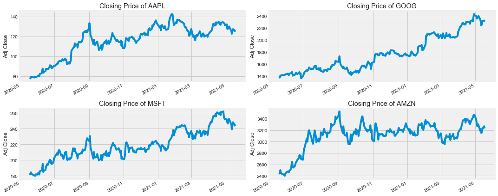
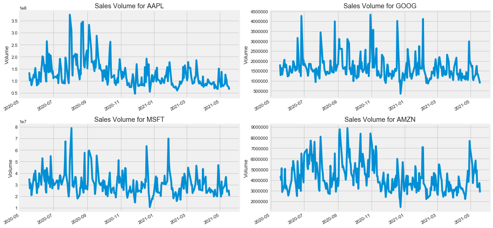
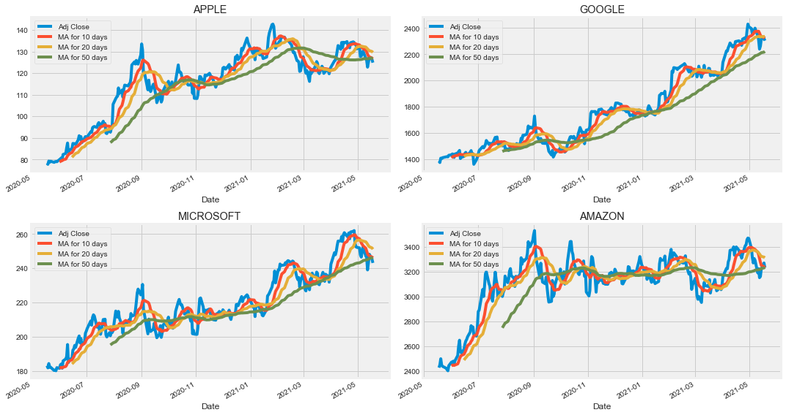
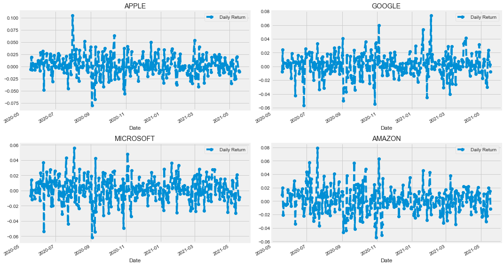
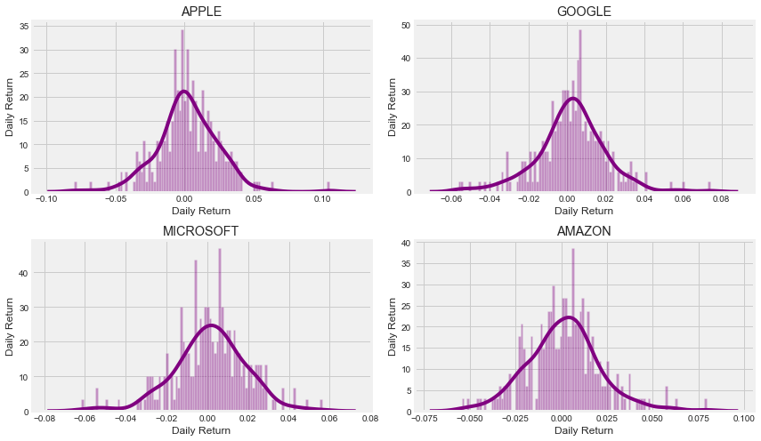

```python
import pandas as pd
import numpy as np

import matplotlib.pyplot as plt
import seaborn as sns
sns.set_style('whitegrid')
plt.style.use("fivethirtyeight")
%matplotlib inline

# For reading stock data from yahoo
from pandas_datareader.data import DataReader

# For time stamps
from datetime import datetime
```


```python
# The tech stocks we'll use for this analysis
tech_list = ['AAPL', 'GOOG', 'MSFT', 'AMZN']

# Set up End and Start times for data grab
end = datetime.now()
start = datetime(end.year - 1, end.month, end.day)


#For loop for grabing yahoo finance data and setting as a dataframe
for stock in tech_list:   
    # Set DataFrame as the Stock Ticker
    globals()[stock] = DataReader(stock, 'yahoo', start, end)
```


```python
company_list = [AAPL, GOOG, MSFT, AMZN]
company_name = ["APPLE", "GOOGLE", "MICROSOFT", "AMAZON"]

for company, com_name in zip(company_list, company_name):
    company["company_name"] = com_name
    
df = pd.concat(company_list, axis=0)
df.tail(10)
```


<div>
<style scoped>
    .dataframe tbody tr th:only-of-type {
        vertical-align: middle;
    }

    .dataframe tbody tr th {
        vertical-align: top;
    }

    .dataframe thead th {
        text-align: right;
    }
</style>
<table border="1" class="dataframe">
  <thead>
    <tr style="text-align: right;">
      <th></th>
      <th>High</th>
      <th>Low</th>
      <th>Open</th>
      <th>Close</th>
      <th>Volume</th>
      <th>Adj Close</th>
      <th>company_name</th>
    </tr>
    <tr>
      <th>Date</th>
      <th></th>
      <th></th>
      <th></th>
      <th></th>
      <th></th>
      <th></th>
      <th></th>
    </tr>
  </thead>
  <tbody>
    <tr>
      <th>2021-05-05</th>
      <td>3354.699951</td>
      <td>3264.360107</td>
      <td>3338.860107</td>
      <td>3270.540039</td>
      <td>3711300.0</td>
      <td>3270.540039</td>
      <td>AMAZON</td>
    </tr>
    <tr>
      <th>2021-05-06</th>
      <td>3314.399902</td>
      <td>3247.199951</td>
      <td>3270.000000</td>
      <td>3306.370117</td>
      <td>4447700.0</td>
      <td>3306.370117</td>
      <td>AMAZON</td>
    </tr>
    <tr>
      <th>2021-05-07</th>
      <td>3330.889893</td>
      <td>3289.070068</td>
      <td>3319.090088</td>
      <td>3291.610107</td>
      <td>4706800.0</td>
      <td>3291.610107</td>
      <td>AMAZON</td>
    </tr>
    <tr>
      <th>2021-05-10</th>
      <td>3283.000000</td>
      <td>3190.000000</td>
      <td>3282.320068</td>
      <td>3190.489990</td>
      <td>5838600.0</td>
      <td>3190.489990</td>
      <td>AMAZON</td>
    </tr>
    <tr>
      <th>2021-05-11</th>
      <td>3238.000000</td>
      <td>3127.370117</td>
      <td>3136.280029</td>
      <td>3223.909912</td>
      <td>4619800.0</td>
      <td>3223.909912</td>
      <td>AMAZON</td>
    </tr>
    <tr>
      <th>2021-05-12</th>
      <td>3207.939941</td>
      <td>3133.100098</td>
      <td>3185.000000</td>
      <td>3151.939941</td>
      <td>4936400.0</td>
      <td>3151.939941</td>
      <td>AMAZON</td>
    </tr>
    <tr>
      <th>2021-05-13</th>
      <td>3203.840088</td>
      <td>3133.000000</td>
      <td>3185.469971</td>
      <td>3161.469971</td>
      <td>3350900.0</td>
      <td>3161.469971</td>
      <td>AMAZON</td>
    </tr>
    <tr>
      <th>2021-05-14</th>
      <td>3228.860107</td>
      <td>3183.000000</td>
      <td>3185.560059</td>
      <td>3222.899902</td>
      <td>3321400.0</td>
      <td>3222.899902</td>
      <td>AMAZON</td>
    </tr>
    <tr>
      <th>2021-05-17</th>
      <td>3292.750000</td>
      <td>3234.590088</td>
      <td>3245.929932</td>
      <td>3270.389893</td>
      <td>3717900.0</td>
      <td>3270.389893</td>
      <td>AMAZON</td>
    </tr>
    <tr>
      <th>2021-05-18</th>
      <td>3312.000000</td>
      <td>3230.370117</td>
      <td>3292.570068</td>
      <td>3232.280029</td>
      <td>2828391.0</td>
      <td>3232.280029</td>
      <td>AMAZON</td>
    </tr>
  </tbody>
</table>
</div>


```python
# Summary Stats
AAPL.describe()

```


<div>
<style scoped>
    .dataframe tbody tr th:only-of-type {
        vertical-align: middle;
    }

    .dataframe tbody tr th {
        vertical-align: top;
    }

    .dataframe thead th {
        text-align: right;
    }
</style>
<table border="1" class="dataframe">
  <thead>
    <tr style="text-align: right;">
      <th></th>
      <th>High</th>
      <th>Low</th>
      <th>Open</th>
      <th>Close</th>
      <th>Volume</th>
      <th>Adj Close</th>
    </tr>
  </thead>
  <tbody>
    <tr>
      <th>count</th>
      <td>253.000000</td>
      <td>253.000000</td>
      <td>253.000000</td>
      <td>253.000000</td>
      <td>2.530000e+02</td>
      <td>253.000000</td>
    </tr>
    <tr>
      <th>mean</th>
      <td>117.794122</td>
      <td>114.743676</td>
      <td>116.378073</td>
      <td>116.293528</td>
      <td>1.278139e+08</td>
      <td>115.861074</td>
    </tr>
    <tr>
      <th>std</th>
      <td>16.398594</td>
      <td>15.973997</td>
      <td>16.325820</td>
      <td>16.156827</td>
      <td>5.253745e+07</td>
      <td>16.257821</td>
    </tr>
    <tr>
      <th>min</th>
      <td>79.125000</td>
      <td>77.580002</td>
      <td>78.292503</td>
      <td>78.285004</td>
      <td>4.669130e+07</td>
      <td>77.761040</td>
    </tr>
    <tr>
      <th>25%</th>
      <td>112.199997</td>
      <td>108.730003</td>
      <td>110.404999</td>
      <td>110.339996</td>
      <td>9.025720e+07</td>
      <td>109.799110</td>
    </tr>
    <tr>
      <th>50%</th>
      <td>121.550003</td>
      <td>118.790001</td>
      <td>120.110001</td>
      <td>120.129997</td>
      <td>1.125592e+08</td>
      <td>119.916817</td>
    </tr>
    <tr>
      <th>75%</th>
      <td>129.720001</td>
      <td>126.760002</td>
      <td>128.500000</td>
      <td>127.900002</td>
      <td>1.531980e+08</td>
      <td>127.683121</td>
    </tr>
    <tr>
      <th>max</th>
      <td>145.089996</td>
      <td>141.369995</td>
      <td>143.600006</td>
      <td>143.160004</td>
      <td>3.743368e+08</td>
      <td>142.704010</td>
    </tr>
  </tbody>
</table>
</div>


```python
# Let's see a historical view of the closing price


plt.figure(figsize=(15, 6))
plt.subplots_adjust(top=1.25, bottom=1.2)

for i, company in enumerate(company_list, 1):
    plt.subplot(2, 2, i)
    company['Adj Close'].plot()
    plt.ylabel('Adj Close')
    plt.xlabel(None)
    plt.title(f"Closing Price of {tech_list[i - 1]}")
    
plt.tight_layout()
```





```python
# Now let's plot the total volume of stock being traded each day
plt.figure(figsize=(15, 7))
plt.subplots_adjust(top=1.25, bottom=1.2)

for i, company in enumerate(company_list, 1):
    plt.subplot(2, 2, i)
    company['Volume'].plot()
    plt.ylabel('Volume')
    plt.xlabel(None)
    plt.title(f"Sales Volume for {tech_list[i - 1]}")
    
plt.tight_layout()
```





```python
ma_day = [10, 20, 50]

for ma in ma_day:
    for company in company_list:
        column_name = f"MA for {ma} days"
        company[column_name] = company['Adj Close'].rolling(ma).mean()
```


```python
fig, axes = plt.subplots(nrows=2, ncols=2)
fig.set_figheight(8)
fig.set_figwidth(15)

AAPL[['Adj Close', 'MA for 10 days', 'MA for 20 days', 'MA for 50 days']].plot(ax=axes[0,0])
axes[0,0].set_title('APPLE')

GOOG[['Adj Close', 'MA for 10 days', 'MA for 20 days', 'MA for 50 days']].plot(ax=axes[0,1])
axes[0,1].set_title('GOOGLE')

MSFT[['Adj Close', 'MA for 10 days', 'MA for 20 days', 'MA for 50 days']].plot(ax=axes[1,0])
axes[1,0].set_title('MICROSOFT')

AMZN[['Adj Close', 'MA for 10 days', 'MA for 20 days', 'MA for 50 days']].plot(ax=axes[1,1])
axes[1,1].set_title('AMAZON')

fig.tight_layout()
```





```python
# We'll use pct_change to find the percent change for each day
for company in company_list:
    company['Daily Return'] = company['Adj Close'].pct_change()

# Then we'll plot the daily return percentage
fig, axes = plt.subplots(nrows=2, ncols=2)
fig.set_figheight(8)
fig.set_figwidth(15)

AAPL['Daily Return'].plot(ax=axes[0,0], legend=True, linestyle='--', marker='o')
axes[0,0].set_title('APPLE')

GOOG['Daily Return'].plot(ax=axes[0,1], legend=True, linestyle='--', marker='o')
axes[0,1].set_title('GOOGLE')

MSFT['Daily Return'].plot(ax=axes[1,0], legend=True, linestyle='--', marker='o')
axes[1,0].set_title('MICROSOFT')

AMZN['Daily Return'].plot(ax=axes[1,1], legend=True, linestyle='--', marker='o')
axes[1,1].set_title('AMAZON')

fig.tight_layout()
```





```python
# Note the use of dropna() here, otherwise the NaN values can't be read by seaborn
plt.figure(figsize=(12, 7))

for i, company in enumerate(company_list, 1):
    plt.subplot(2, 2, i)
    sns.distplot(company['Daily Return'].dropna(), bins=100, color='purple')
    plt.ylabel('Daily Return')
    plt.title(f'{company_name[i - 1]}')
# Could have also done:
#AAPL['Daily Return'].hist()
plt.tight_layout()
```





```python

```
